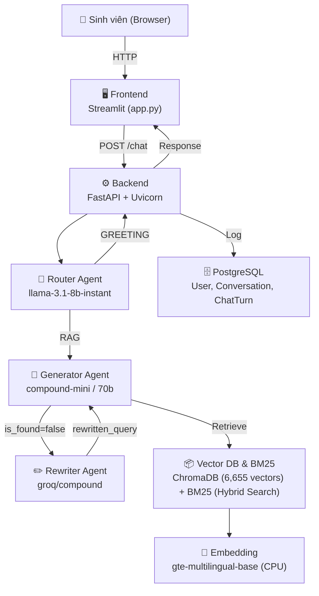

# Kiến trúc Hệ thống

## Tổng quan



## Luồng xử lý `/chat` endpoint

### Bước 1: Intent Routing
```
User question → llm_router → {"intent": "GREETING" | "RAG"}
├── GREETING → Trả lời trực tiếp, bỏ qua CSDL
└── RAG → Bắt đầu vòng lặp Self-Correction
```
- **Logging cải tiến**: Khi Router gặp lỗi, nội dung payload (nếu có) sẽ được in ra để hỗ trợ debug.

### Bước 2: Self-Correction Loop (RAG)

- **Prompt Caching**: Static prefix (vai trò, quy tắc, JSON mẫu) được đưa lên đầu prompt, chỉ có `{context}` và `{question}` là phần động để tối ưu.
- **Regex Fallback**: Backend cài đặt Regex Fallback để bắt chuỗi JSON ở tầng thấp nhất, tránh lỗi đứt gãy khi các model mở (VD: Llama 3.1) sinh text trò chuyện xung quanh JSON.

```
current_query = question (vòng 1)
while retries <= max_retries (số lần lặp tối đa phụ thuộc vào cờ is_thinking - Thinking Mode):
    1. retriever.invoke(current_query) → top 5 chunks
    2. Generator: {"is_found": true/false, "answer": "..."}
    3. Nếu is_found=true → RETURN
    4. Nếu is_found=false:
       - Ghi nhận failed_queries
       - Rewriter sinh rewritten_query mới (tinh chỉnh câu hỏi cũ và giải nghĩa từ viết tắt học vụ như dktc, kltn...)
       - current_query = rewritten_query
       - retries++
```

### Bước 3: Lưu Postgres
```
User (mock) → Conversation (default) → ChatTurn (query + response + context)
```

## Modules chi tiết

### `backend/main.py` — API Controller
- Cấu trúc Modular phân tách rõ ràng, chuẩn bị sẵn sàng cho việc mở rộng thay thế bằng ReactJS ở Frontend.
- FastAPI app với 2 endpoints: `POST /chat`, `GET /chat/history`
- Startup event: `init_agents()` → `create_db_and_tables()` → `get_retriever()`
- Dependency injection: SQLModel Session cho mỗi request

### `backend/llm_agent.py` — Agentic RAG Core (412 dòng)
- **Key Rotation**: 10 Groq API keys, shuffle lúc khởi tạo, round-robin khi rate limit
- **Chain Rebuild**: Mỗi lần rotate key → `_rebuild_all_chains()` ép LangChain dùng key mới
- **Generator Fallback 2 tầng**: compound-mini → llama-3.3-70b → rotate key
- **Hàm chính**: `run_agentic_rag()` — tái sử dụng ở cả API lẫn Jupyter Notebook
- **Debug 413**: `_debug_413()` in chi tiết token count khi request quá lớn

### `backend/vector_store.py` — ChromaDB Loader
- Singleton pattern: `_retriever_instance` load 1 lần duy nhất
- Embedding: `Alibaba-NLP/gte-multilingual-base` chạy CPU
- Collection: `academic_regulations`, top-k = 5

### `backend/database.py` — PostgreSQL ORM
- 3 tables: `User`, `Conversation`, `ChatTurn`
- SQLModel (= SQLAlchemy + Pydantic)
- Auto-create tables on startup (không dùng Alembic migration)

#### Schema Design (ERD Cơ bản)
**Table: `User`** (Tạm thời mock 1 user mặc định)
- `id`: UUID (Primary Key)
- `username`: String (Unique)
- `email`: String (Unique)
- `created_at`, `updated_at`: Datetime

**Table: `Conversation`** (Một User tạo nhiều phiên chat)
- `id`: UUID (Primary Key)
- `user_id`: UUID (Foreign Key -> User.id)
- `title`: String (Tóm tắt tự động ý chính phiên chat)
- `created_at`, `updated_at`: Datetime

**Table: `ChatTurn`** (Các dòng tin nhắn trong phiên chat)
- `id`: UUID (Primary Key)
- `conversation_id`: UUID (Foreign Key -> Conversation.id)
- `user_query`: Text (Câu hỏi của sinh viên)
- `ai_reponse`: Text (Câu trả lời của AI)
- `turn_summary`: Text (Tóm tắt ngắn gọn cặp hỏi-đáp)
- `context_used`: Text (Văn bản được dùng để trả lời)
- `created_at`: Datetime

### `frontend/app.py` — Streamlit UI
- Chat interface với lịch sử từ API
- Toggle "Thinking Mode" (max 3 retries)
- Status bar hiển thị tiến trình suy nghĩ AI
- Expander hiển thị context gốc được truy vấn
